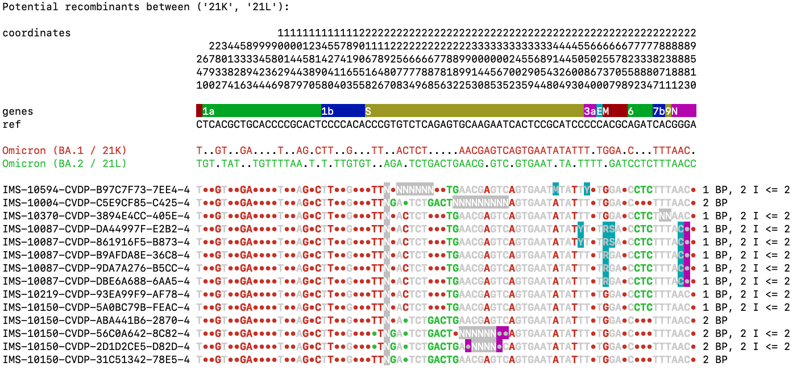

# What's this?
This program can search genome sequences of SARS-CoV-2 for potential recombinants - new virus lineages that have (partial) genes from more than one parent lineage.

# Is it already usable? 
**This is a very young project, started on March 5th, 2022. As such, proceed with care. Results may be wrong or misleading, and with every update, anything can still change a lot.**

Anyway, I'm happy that scientists are already seeing benefits from this tool and using it to prepare lineage proposals for [cov-lineages/pango-designation](https://github.com/cov-lineages/pango-designation/issues).

Though I already have a lot of ideas and plans for this (see at the bottom of this document), I'm very open for suggestions and feature requests. Please write an [issue](https://github.com/lenaschimmel/sarscov2recombinants/issues), start a [discussion](https://github.com/lenaschimmel/sarscov2recombinants/discussions) or get in touch via [mail](mailto:mail@lenaschimmel.de) or [twitter](https://twitter.com/LenaSchimmel)!

# Example output


# Requirements and Installation
You need at least Python 3.6 and you need to install the requirements first. You might use something like `pip3 install -r requirements.txt` to do that.

Also, you need a terminal which supports ANSI control sequences to display colored text. On Linux, MacOS, etc. it should probably work. 

On Windows, color support is tricky. On a recent version of Windows 10, it should work, but if it doesn't, install Windows Terminal from [GitHub](https://github.com/Microsoft/Terminal) or [Microsoft Store](https://www.microsoft.com/de-de/p/windows-terminal/9n0dx20hk701?rtc=1&activetab=pivot:overviewtab) and run it from there.

# Basic Usage
Start with a `.fasta` file with one or more sequences which might contain recombinants. Your sequences have to be aligned to the `reference.fasta`. If they are not, you will get an error message like:

> Sequence hCoV-19/Phantasialand/EFWEFWD not properly aligned, length is 29718 instead of 29903.

_(For historical reasons, I always used [Nextclade](https://docs.nextstrain.org/projects/nextclade/en/stable/user/nextclade-cli.html) to get aligned sequences, but you might also use [Nextalign](https://docs.nextstrain.org/projects/nextclade/en/stable/user/nextalign-cli.html) or any other tool. Installing them is easy on Linux or MacOS, but not on Windows. You can also use a web-based tool like [MAFFT](https://mafft.cbrc.jp/alignment/software/closelyrelatedviralgenomes.html).)_

Then call:

```
search_recombinants.py <your_filename.fasta>
```

# Advanced Usage
You can execute `search_recombinants.py -h` to get excactly this help message:

<!-- BEGIN_MARKER -->
```
usage: search_recombinants.py [-h]
                              [--primers [PRIMER [PRIMER ...]]]
                              [--parents INTERVAL]
                              [--breakpoints INTERVAL]
                              [--clades [CLADES [CLADES ...]]]
                              [--unique NUM]
                              [--max-intermission-length NUM]
                              [--max-intermission-count NUM]
                              [--max-name-length NUM]
                              [--max-ambiguous NUM]
                              [--force-all-parents]
                              [--select-sequences INTERVAL]
                              [--enable-deletions]
                              [--show-private-mutations]
                              [--rebuild-examples]
                              [--mutation-threshold NUM]
                              [--add-spaces [NUM]]
                              [--sort-by-id [NUM]] [--verbose]
                              [input [input ...]]

Analyse SARS-CoV-2 sequences for potential, unknown recombinant
variants.

positional arguments:
  input                 input sequence(s) to test, as aligned
                        .fasta file(s) (default: None)

optional arguments:
  -h, --help            show this help message and exit

  --primers [PRIMER [PRIMER ...]]
                        Filenames of primer set(s) to visualize.
                        The .bed formats for ARTIC and easyseq
                        are recognized and supported. (default:
                        None)

  --parents INTERVAL, -p INTERVAL
                        Allowed number of potential parents of a
                        recombinant. (default: 2-4)

  --breakpoints INTERVAL, -b INTERVAL
                        Allowed number of breakpoints in a
                        recombinant. (default: 1-4)

  --clades [CLADES [CLADES ...]], -c [CLADES [CLADES ...]]
                        List of clades which are considered as
                        potential parents. Use Nextclade names,
                        i.e. "21A". Also accepts "all". (default:
                        ['20I', '20H', '20J', '21A', '21K',
                        '21L', '21BA3'])

  --unique NUM, -u NUM  Minimum of substitutions in a sample
                        which are unique to a potential parent
                        clade, so that the clade will be
                        considered. (default: 2)

  --max-intermission-length NUM, -l NUM
                        The maximum length of an intermission in
                        consecutive substitutions. Intermissions
                        are stretches to be ignored when counting
                        breakpoints. (default: 2)

  --max-intermission-count NUM, -i NUM
                        The maximum number of intermissions which
                        will be ignored. Surplus intermissions
                        count towards the number of breakpoints.
                        (default: 8)

  --max-name-length NUM, -n NUM
                        Only show up to NUM characters of sample
                        names. (default: 30)

  --max-ambiguous NUM, -a NUM
                        Maximum number of ambiguous nucs in a
                        sample before it gets ignored. (default:
                        50)

  --force-all-parents, -f
                        Force to consider all clades as potential
                        parents for all sequences. Only useful
                        for debugging.

  --select-sequences INTERVAL, -s INTERVAL
                        Use only a specific range of input
                        sequences. DOES NOT YET WORK WITH
                        MULTIPLE INPUT FILES. (default: 0-999999)

  --enable-deletions, -d
                        Include deletions in lineage comparision.

  --show-private-mutations
                        Display mutations which are not in any of
                        the potential parental clades.

  --rebuild-examples, -r
                        Rebuild the mutations in examples by
                        querying cov-spectrum.org.

  --mutation-threshold NUM, -t NUM
                        Consider mutations with a prevalence of
                        at least NUM as mandatory for a clade
                        (range 0.05 - 1.0, default: 0.75).

  --add-spaces [NUM]    Add spaces between every N colums, which
                        makes it easier to keep your eye at a
                        fixed place. (default without flag: 0,
                        default with flag: 5)

  --sort-by-id [NUM]    Sort the input sequences by the ID. If
                        you provide NUM, only the first NUM
                        characters are considered. Useful if this
                        correlates with meaning full meta
                        information, e.g. the sequencing lab.
                        (default without flag: 0, default with
                        flag: 999)

  --verbose, -v         Print some more information, mostly
                        useful for debugging.

An Interval can be a single number ("3"), a closed interval
("2-5" ) or an open one ("4-" or "-7"). The limits are inclusive.
Only positive numbers are supported.

```
<!-- END_MARKER -->

# No output / some sequences not shown
By default, a lot filters are active to show only the likely recombinants, so that you can input 10000s of sequences and just get output for the interesting ones. If you want, you can disable all filters like that, which is only recommended for small input files with less than 100 sequences:

```
search_recombinants.py --parents 1-35 --breakpoints 0-100 \
--unique 0 --max-ambiguous 10000 <your_filename.fasta>
```

or even

```
search_recombinants.py --parents 1-35 --breakpoints 0-100 \
--unique 0 --max-ambiguous 10000 --force-all-parents \
--clades all <your_filename.fasta>
```

# Interpreting the output
_To be written..._

# Source material attribution
 * `virus_properties.json` contains data from [LAPIS / cov-](https://lapis.cov-spectrum.org/) which uses data from [NCBI GenBank](https://www.ncbi.nlm.nih.gov/genbank/), prepared and hosted by Nextstrain, see [blog post](https://nextstrain.org/blog/2021-07-08-ncov-open-announcement).
 * `reference.fasta` is taken from Nextstrain's [nextclade_data](https://github.com/nextstrain/nextclade_data/tree/master/data/datasets/sars-cov-2/references/MN908947/versions/2022-03-04T12:00:00Z/files), see [NCBI](https://www.ncbi.nlm.nih.gov/nuccore/MN908947) for attribution. 
 * `mapping.csv` is a modified version of the table on the [covariants homepage](https://covariants.org/) by Nextstrain.
 * Example output / screenshot based on Sequences published by the [German Robert-Koch-Institut](https://github.com/robert-koch-institut/SARS-CoV-2-Sequenzdaten_aus_Deutschland).

The initial version of this program was written in cooperation with [@flauschzelle](https://github.com/flauschzelle).

# TODO / IDEAS / PLANS
 * [ ] Move these TODOs into actual issues
 * [x] add disclaimer and link to pango-designation
 * [ ] provide a sample file (maybe both `.fasta` and `.csv`, as long as the csv step is still needed)
 * [X] accept aligned fasta 
   * [x] as input file
   * [ ] as piped stream
 * [ ] If we still accept csv/ssv input, autodetect the delimiter either by file name or by analysing the first line
 * [ ] find a way to handle already designated recombinant lineages
 * [ ] Output structured results
   * [ ] csv
   * [ ] html?
   * [ ] fasta of all sequences that match the criteria, which enables efficient multi-pass strategies
 * [ ] filter sequences
   * [ ] by ID
   * [ ] by metadata
 * [ ] take metadata csv
 * [ ] document the output in README
 * [ ] check / fix `--enabled-deletions`
 * [x] adjustable threshold for mutation prevalence
 * [ ] new color mode (with background color and monochrome text on top)
 * [ ] new bar mode (with colored lines beneath each sequence, one for each example sequence, and "intermissions" shown in the color of the "surrounding" lineage, but not as bright)
 * [ ] interactive mode, for filtering, reordering, etc.
 * [x] sort sequences within each block
 * [ ] re-think this whole "intermission" concept
 * [ ] select a single sequence and let the tool refine the choice of parental sequences, not just focusing on commonly known lineages (going up and down in the tree)
 * [ ] use more common terms to describe things (needs feedback from people with actual experience in the field)